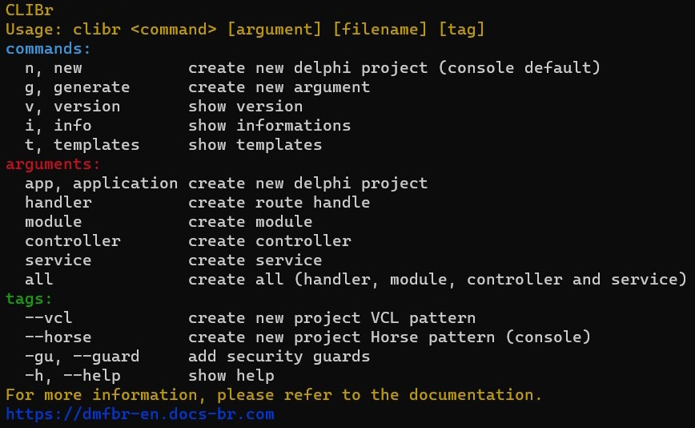

<p align="center">ModularBr is a Framework for Delphi designed to build efficient and scalable applications.</p>
<p align="center">
  
</p>

# Description
CLIBr is a command-line tool that assists in initializing, developing, and maintaining applications using ModularBr. It provides assistance in various ways, including creating the project's basic structure and complete modules. It incorporates architectural patterns of best practices to encourage the creation of well-structured applications.

Project developed in C++ and code analyzed using a static analysis guideline tool. I appreciate the PVS-Studio team for providing a license for open-source projects' usage.

### SAST Tools
[PVS-Studio]( https://pvs-studio.com/en/pvs-studio/?utm_source=website&utm_medium=github&utm_campaign=open_source ) - static analyzer for C, C++, C#, and Java code.

### Getting started

Installation:
 * Download [setup](https://github.com/HashLoad/clibr/releases)
 * Just type `clibr` in cmd

## Available Commands

### > Help
This is a helper for clibr.
```
clibr --help
```
<p align="center">
  
</p> 

### > New project
This command initialize a new project.
```
clibr new ./appapi/api
```
<p align="center">
  
</p> 

###### Aliases: n

### > Informations
This command show the client informations
```
clibr info
```
<p align="center">
  
</p> 

###### Aliases: i

### > Version
This command show the client version
```
clibr --version
```

###### Aliases: -v

## Flags

### > --vcl --horse, --guard 
This flag defines new project partner Horse or VCL
```
clibr new app my_api --horse
clibr new app my_api --vcl
```

### > Help command
This is a helper for clibr. Use `clibr <command> --help` for more information about a command.
```
clibr new --help
```

###### Aliases: -h

